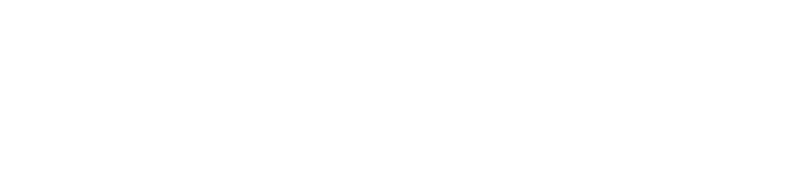

======================================================================================================================================

Software Developer
--------------

I have graduated from Instituto Politécnico do Porto, in Computer Engineering for 3 years. I also took 2 more courses on Udemy, one of the courses includes the development using Flutter and another in Web development. At this moment I plan to follow my studies in a master's degree in Artificial Intelligence.

* 🌍  I'm based in Porto
* 🖥️  See my portfolio at [MyPortfolio](http://www.dei.isep.ipp.pt/~1201115/)
* ✉️  You can contact me at [miguelalmeida2002@gmail.com](mailto:miguelalmeida2002@gmail.com)
* 🧠  I'm learning HTML5, CSS3, BootStrap 4, JS, ES6, ES7, PHP 7, OO, MySQL, JQuery, MVC, API, IONIC
* 🤝  I'm open to collaborating on interesting projects

### Skills

### Socials

      

### Badges

<b>My GitHub Stats</b>

### Support Me

